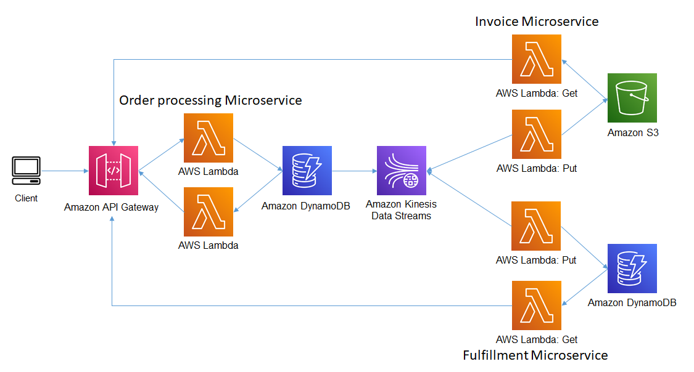

## Example
This example demonstrates an event sourcing architecture using Amazon Kinesis. Records are loaded into the kinesis stream using a Lambda function which is integrated with Amazon API Gateway. The Lambda function takes the input from the gateway and writes it to an Amazon Kinesis data stream. 

The event triggers 2 additional Lambda functions. The invoice function writes the event object to an Amazon S3 bucket. The fulfillment function writes the event data to Amazon DynamoDB. You would use a pattern or something similar, when you required realtime or near realtime data record processing.

There are 3 additional functions used to return items from Amazon DynamoDB or objects from Amazon S3.



1. The first script creates items (orders) and posts them to an Amazon API Gateway which triggers a Lambda function. The Lambda function does two things. 
   
    a. It writes each item to an Amazon DynamoDB table (event_sourcing_kinesis_order table)

    b. It writes the item to an Amazon Kinesis Stream

    c. The Kinesis Stream triggers 2 Lambda functions. Both functions pull the records from the stream, one function writes each record to an Amazon S3 bucket, while the other function writes each record to a Amazon DynamoDB table.

2. The second script is a json formatter which renders json data into a readable format.
   
3. The third script retrieves an item from the event_sourcing_kinesis_order table using the parition key (accountid) and sort key (vendorid)
   
4. The fourth script retrieves an item from the event_sourcing_kinesis_fulfillment table using the parition key (accountid) and sort key (vendorid)

5. The final script makes a call to Amazon ApiGateway service which in turn calls a triggers a function that generates a pre-signed url for an S3 object.
   
## Setup

1. The following prerequisities are required for this example
  
```bash
npm install -g typescript
npm install -g aws-cdk
```

Install Jupyter Notebook following instructions on this ['site'](https://jupyter.org/install).

2. Since this CDK project uses ['Assests'](https://docs.aws.amazon.com/cdk/latest/guide/assets.html), you might need to run the following command to provision resources the AWS CDK will need to perform the deployment.

```bash 
cdk bootstrap
```

2. Install the dependencies

```bash
npm install
```

3. Execute **cdk synth** to synthesize as AWS CloudFormation template

```bash
cdk synth
```

4. Execute **cdk deploy** to deploy the template and build the stack

```bash
cdk deploy
```
5. Open the Jupyter Notebook in the **jupyter_notebook directory** follow the instructions.

6. Check the dynamoDB table to view the records and S3 bucket to view the invoices

## Cleanup Commands
1. Execute command: **cdk destroy**