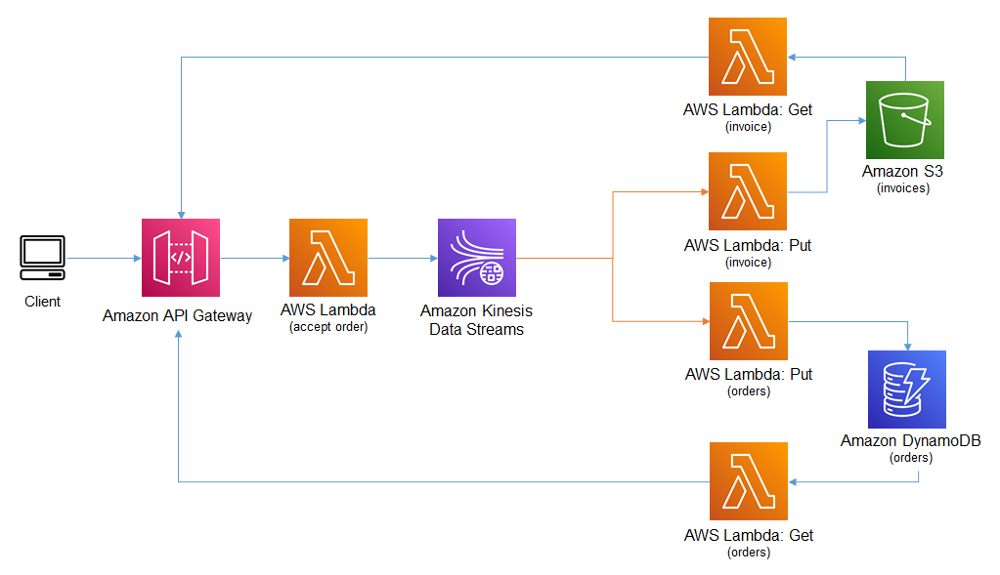

## Example
This example demonstrates how to use Amazon Kinesis Data Streams in an event sourcing architecture. Records are sent to the Amazon API Gateway which invokes an AWS Lambda function that loads the records into a Kinesis Data Stream. As records are added to the stream additional Lambda functions are invoke to consume the events. 

One function will write the event to an Amazon S3 bucket as an object, at same time the other function will write the event to an Amazon DynamoDB table as an item. The record will remain visible in the queue and can be processed simultaneously any consumer monitoring the queue for new records.

You would use this pattern or something similar, when you require real-time or near real-time data record processing. 



   
## Setup

You will need to download and install [Node.js](https://nodejs.org/en/download/) before you can start using the AWS Cloud Development Kit.


This example is developed using the AWS CDK and Typescript, so you will need to install both Typescript and the CDK using the following commands
```
npm install -g typescript
npm install -g aws-cdk@latest
```
Since this CDK project uses ['Assests'](https://docs.aws.amazon.com/cdk/latest/guide/assets.html), you might need to run the following command to provision resources the AWS CDK will need to perform the deployment.

```bash 
cdk bootstrap
```

The testing scripts can be executed using Jupyter Notebook. There are a few methods for installing Jupyter Notebooks. These instructions will help you get to started with [JupyterLab](https://jupyter.org/install) installation. 

You can also install Jupyter Notebooks as part of [Anaconda](https://docs.anaconda.com/anaconda/install/index.html) installation.

To download this example, you will need to install [Git](https://github.com/git-guides/install-git). After installing git follow these [instructions](https://github.com/git-guides/git-clone) to learn how to clone the repository.

After the repository has been cloned set the command prompt path to the cloned directory and run the following command to install the project dependencies.

```bash
npm install
```

**cdk synth** executes the application which translates the Typescript code into an AWS CloudFormation template.

```bash
cdk synth
```

After the synth command has generated the template use the  **cdk deploy** command to deploy the template to AWS CloudFormation and build the stack.

```bash
cdk deploy
```

## Run the Example
Open the Jupyter Notebook in the **jupyter_notebook directory** follow the instructions.


## Cleanup
From the command prompt execute the following command: **cdk destroy**