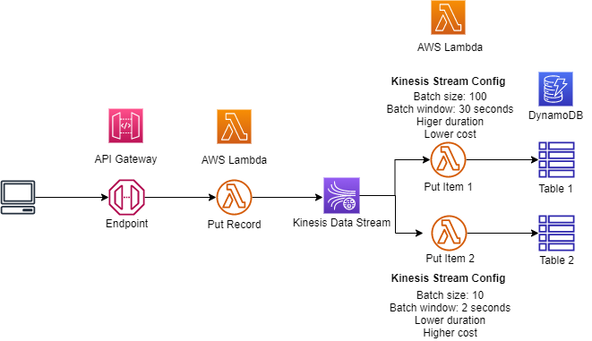

## Example
This example demonstrates an event sourcing architecture using Amazon Kinesis. Records are loaded into the kinesis stream by the process order microservice and the records are then consumed by the invoice and fulfillment microservices. You would use a pattern similar to this when you required realtime or near realtime data record processing.



## Setup

1. The following prerequisities are required for this example
  
```bash
npm install -g typescript
npm install -g aws-cdk
```

Install Jupyter Notebook following instructions on this ['site'](https://jupyter.org/install).

2. Since this CDK project uses ['Assests'](https://docs.aws.amazon.com/cdk/latest/guide/assets.html), you might need to run the following command to provision resources the AWS CDK will need to perform the deployment.

```bash 
cdk bootstrap
```

2. Install the dependencies

```bash
npm install
```

3. Execute **cdk synth** to synthesize as AWS CloudFormation template

```bash
cdk synth
```

4. Execute **cdk deploy** to deploy the template and build the stack

```bash
cdk deploy
```
5. Open the Jupyter Notebook in the **jupyter_notebook directory** follow the instructions and execute the query.

6. Check the dynamoDB table to view the records

## Cleanup Commands
1. Execute command: **cdk destroy**